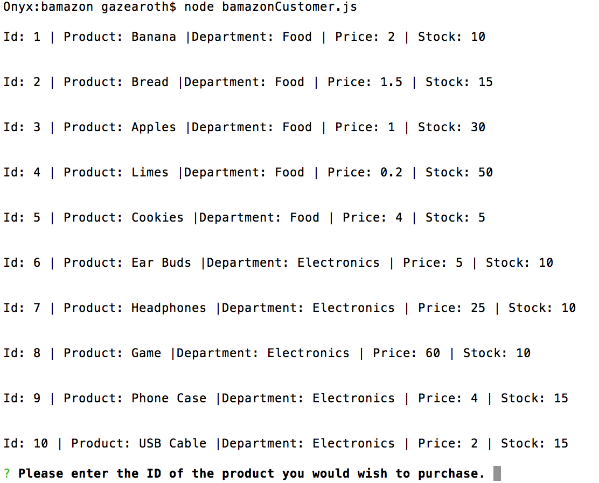
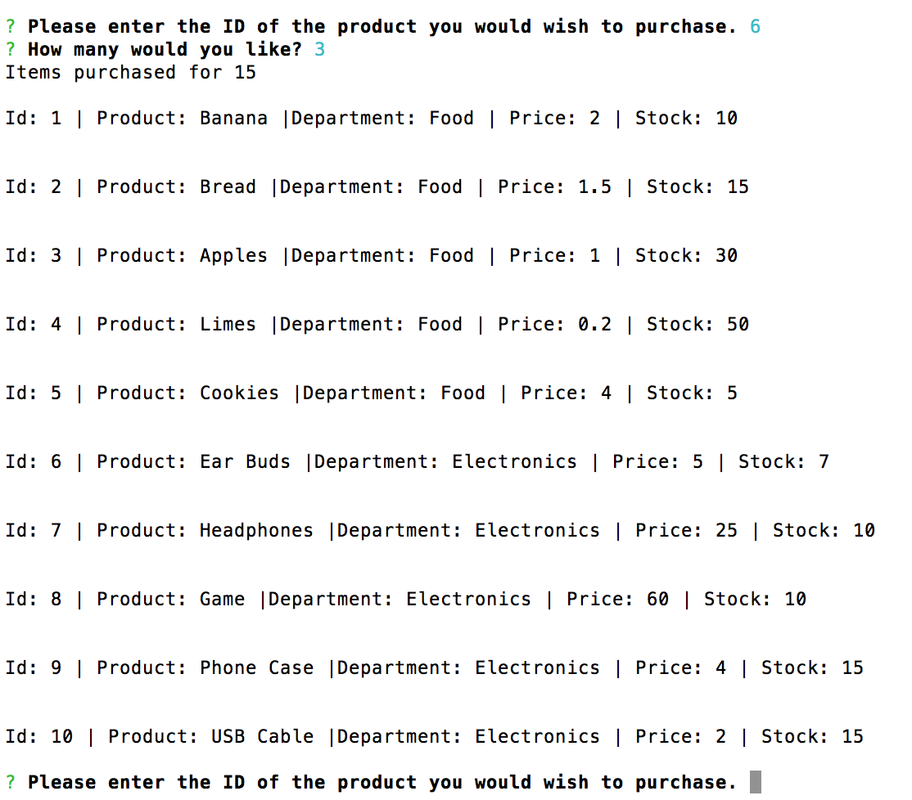
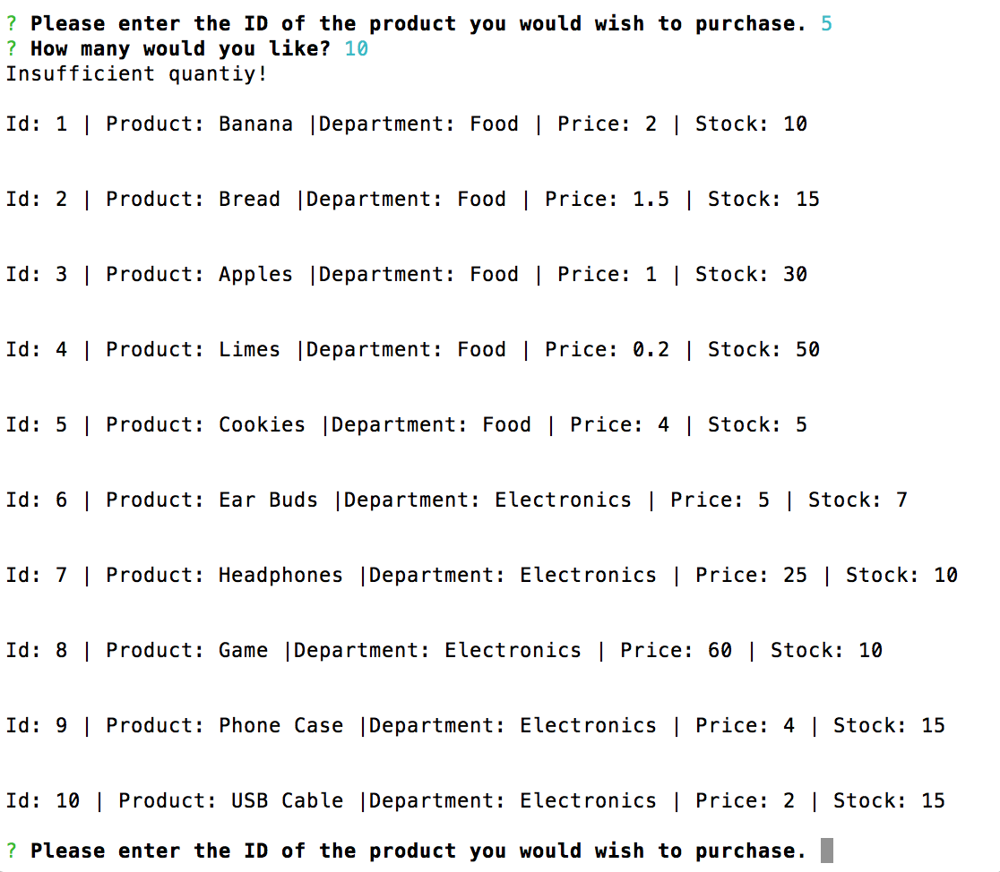

# bamazon

This program is a simple CLI inventory with purchasing power. Running the program will display the existing inventory and prompt the user to select an item by ID.

Once an item is selected the program will ask for a quantity. If there is enough stock the purchase will complete, the total amount will be displayed and the program will restart.

If the requested amount is not available, and error will occur and the program will restart.
